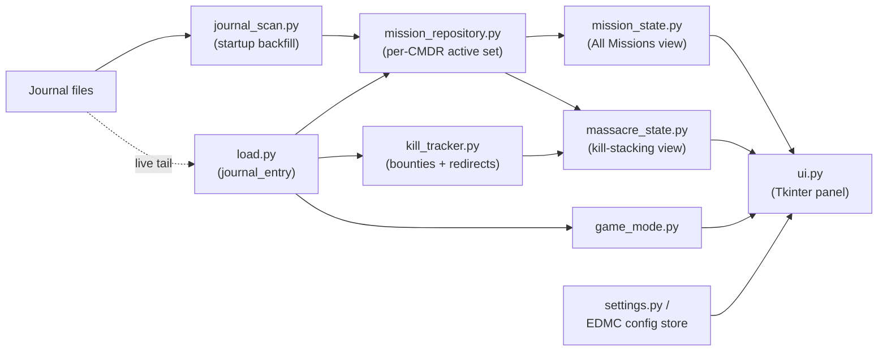

# EDMMM Technical Spec

A look under the hood: the stack, the plugin lifecycle, and how a journal
event turns into a row on the panel. Aimed at anyone reading the source or
contributing, not at end users — see [README.md](README.md) for that.

## Contents

- [Stack](#stack)
- [Plugin lifecycle (EDMC integration points)](#plugin-lifecycle-edmc-integration-points)
- [Data flow](#data-flow)
- [Per-commander isolation](#per-commander-isolation)
- [Mission classification](#mission-classification)
- [Kill-progress estimation](#kill-progress-estimation)
- [Config \& persistence](#config--persistence)
- [Build \& release](#build--release)
- [Notable constraints](#notable-constraints)

## Stack

- **Language:** Python 3, standard library only — no third-party pip
  dependencies. `requirements.txt`/`pyproject.toml` don't exist because
  there's nothing to install beyond what EDMC and the stdlib provide.
- **UI:** Tkinter. The main panel (`ui.py`) is plain `tk` widgets so it
  inherits EDMC's theme colors automatically; the settings tab (`settings.py`)
  goes through EDMC's own `myNotebook` wrapper, since EDMC's prefs dialog may
  back it with `ttk` depending on EDMC's version.
- **Host application:** [EDMarketConnector](https://github.com/EDCD/EDMarketConnector)
  (EDMC). EDMC supplies the `config` module (settings persistence), the
  `theme` module (light/dark theme state), and the plugin lifecycle contract
  described below. EDMMM cannot run outside EDMC — it's a plugin, not an
  application.
- **No network calls, ever.** All data comes from local journal files (see
  [Data flow](#data-flow)); nothing is sent anywhere.
- **Build tooling:** `scripts/build.py` (stdlib `shutil`/`zipfile` only).
  CI/release run on GitHub Actions.

## Plugin lifecycle (EDMC integration points)

`EDMMM/load.py` is the plugin entry point — EDMC discovers and calls these
functions by name; it's not EDMMM that decides when they run:

- **`plugin_start3(plugin_dir) -> str`** — called once when EDMC starts.
  Kicks off the two-week journal backfill
  (`journal_scan.scan_journals`) and seeds `mission_repository`,
  `kill_tracker`, and `game_mode` with the result. Wrapped in a broad
  `try/except`: a scan failure logs and starts from empty state rather than
  blocking the plugin (and its settings tab) from loading at all.
- **`plugin_app(parent) -> Frame`** — called once to get the widget EDMC
  embeds in its main window. Delegates straight to `ui.UI.set_frame`.
- **`journal_entry(cmdr, is_beta, system, station, entry, state)`** — called
  for *every* journal event, live, for the rest of the session. This is the
  plugin's main nervous system: it dispatches `Missions`, `MissionAccepted`,
  `MissionAbandoned`/`MissionCompleted`/`MissionFailed`, `MissionRedirected`,
  `Bounty`, and `LoadGame` to the relevant module. Everything else is
  ignored.
- **`plugin_prefs(parent, cmdr, is_beta)` / `prefs_changed(cmdr, is_beta)`**
  — build the Settings tab and commit changes when the dialog closes.

## Data flow

Two sources feed the *same* per-CMDR active-mission set, using an identical
event vocabulary:

1. **`journal_scan.scan_journals()`** — a one-time synchronous scan of the
   last two weeks of `*.log` files at startup. Filters to
   `Commander`/`MissionAccepted`/`Bounty`/`MissionRedirected`/`LoadGame`
   lines only (`_RELEVANT_EVENTS`) and returns a `ScanResult`.
2. **`load.journal_entry()`** — the same event types, live, one journal line
   at a time, for as long as EDMC keeps running.

Both converge on **`mission_repository.MissionRepository`**, the single
source of truth for "what's active right now, for whichever CMDR is
currently playing":

- It keeps two dicts per CMDR: `_mission_store` (every `MissionAccepted`
  ever seen for that CMDR, active or not — the full historical record) and
  `_active_by_cmdr` (the subset EDMC's own `Missions` login event confirms
  is still active).
- `active_missions` returns `None` until a `Missions` event has been seen
  for the current CMDR ("we don't know yet"). The UI uses that
  `None`-vs-empty-dict distinction to tell "no active mission data yet —
  relog" apart from "known, and genuinely zero missions."
- Every mutation re-emits through `active_missions_changed_event_listeners`
  — a plain list of callback functions appended to at import time, not a
  framework event bus. This same pattern (a module-level list of listeners)
  repeats in `mission_state`, `massacre_state`, `kill_tracker`, `game_mode`,
  and `settings`.

Two independent listeners subscribe to the repository and build their own
specialized view of it:

- **`mission_state.py`** builds a `Mission` for *every* active mission
  (any type), tagged with `mission_types.classify()`'s category and
  `mission_types.is_illegal()`. This backs the "All Missions" pages (3–7).
- **`massacre_state.py`** filters down to `mission_types.is_massacre_shaped()`
  missions only (a kill count against a target faction) and builds a
  `MassacreMission` per one. This backs the two detailed kill-stacking
  pages (1–2).

**`kill_tracker.py`** separately accumulates `Bounty` and `MissionRedirected`
evidence per CMDR, independent of which specific missions exist right now.
`massacre_state.compute_progress()` is what ties the two together — kill
progress isn't stored, it's recomputed from current mission + kill state
every time it's needed.

**`game_mode.py`** is a third, independent per-CMDR store, fed only by
`LoadGame` events, for the header's mode label.

**`ui.py`** subscribes to all of the above and is the only module that
touches Tkinter widgets directly. Every notification tears down and
rebuilds the *entire* panel (`update_ui` destroys all children, then
redraws) rather than diffing — simplicity over incremental-update
performance, which is fine given the panel is small and updates are
infrequent (a mission accept/complete/expire, or the 60-second refresh
tick — not per-frame).

## Per-commander isolation

Every stateful module keys its store by CMDR name, not by session:
`mission_repository._mission_store`/`_active_by_cmdr`,
`kill_tracker._bounties`/`_redirected`,
`game_mode._mode_by_cmdr`/`_group_by_cmdr`. Switching commanders
(`mission_repository.set_current_cmdr`, itself driven by the `cmdr`
argument EDMC passes into every `journal_entry` call) just swaps which
CMDR's slice of each dict gets read, then re-emits — nothing is cleared or
rebuilt, so switching back to a previous commander is instant with no
re-scan. There is deliberately no cross-CMDR aggregation anywhere; this is
what the READMEs call "alt-friendly."

## Mission classification

`mission_types.classify()` is a pure function: given a `MissionAccepted`
event dict, return one of the 7 `CATEGORY_ORDER` keys. It's substring-hint
matching against the event's internal `Name` field (lower-cased), checked
in a fixed priority order — massacre-shaped first (`KillCount` +
`TargetFaction`, or name hints), then combat/trade/passenger/covert hints,
falling back to `OTHER`. There's no fuzzy matching or confidence score: a
mission either matches a hint substring or it doesn't. This is why
[CONTRIBUTING.md](CONTRIBUTING.md) asks for hint-string PRs when a mission
lands in the wrong category — it's almost always a missing hint, not a
logic bug.

## Kill-progress estimation

`massacre_state.compute_progress()` is the one genuinely non-trivial
algorithm in the codebase. A `Bounty` event doesn't reference a
`MissionID` — the game just reports "you killed a member of faction X."
The algorithm assigns each bounty to *the earliest still-open mission from
that specific mission-giver, targeting that faction, in the matching arena
(ground vs. space), accepted before the kill happened* — mirroring how the
game's own stacking rewards work: one kill can advance a mission from
*each* distinct giver simultaneously, but only one mission per giver per
kill. `MissionRedirected` is treated as authoritative ground truth and
overrides the estimate for that mission entirely, regardless of what the
bounty-based estimate says.

## Config & persistence

All persisted state (display toggles, current category page) goes through
EDMC's own config store (`config.get_bool`/`config.set`, imported from
EDMC's `config` module) — EDMMM has no database and no config files of its
own. The only disk I/O EDMMM owns outright is its rotating log file
(`logger_factory.py`). This is also why mission/kill tracking is entirely
in-memory and rebuilt from journals on every EDMC restart, while UI
preferences persist immediately and survive restarts on their own.

## Build & release

`scripts/build.py` is the only build step: stdlib-only, copies `EDMMM/`
into `dist/EDMMM/` (stripping `__pycache__`/`logs`) and zips it.
[`.github/workflows/ci.yml`](.github/workflows/ci.yml) runs that plus a
`py_compile` smoke test on every push/PR to `main`.
[`.github/workflows/release.yml`](.github/workflows/release.yml) runs the
same build and publishes a GitHub Release, but only on a `vX.Y.Z` tag push,
and only if the tag matches `EDMMM/version` exactly — so a release can
never publish a build whose in-app version label disagrees with its
download filename. See [CONTRIBUTING.md](CONTRIBUTING.md) for the full
release checklist.

## Notable constraints

- **No automated tests beyond byte-compiling and a successful build.**
  EDMC's own modules (`config`, `theme`, `myNotebook`) aren't installable
  outside EDMC, so nothing in CI exercises the actual plugin logic — a
  live EDMC install is the only real verification path.
- **Single-threaded.** Everything runs on Tk's main loop via EDMC's own
  event dispatch; there's no background thread anywhere in the codebase.
  The startup journal scan runs synchronously and blocks the plugin's own
  startup until it finishes (mitigated by only scanning two weeks of
  files, not the full journal history).
- **Rebuild-everything-on-update.** `ui.py`'s widget tree is destroyed and
  recreated on every mission change and on every 60-second refresh tick
  (`REFRESH_INTERVAL_MS`). Fine at this scale; wouldn't scale to a much
  larger panel without a diffing layer.
