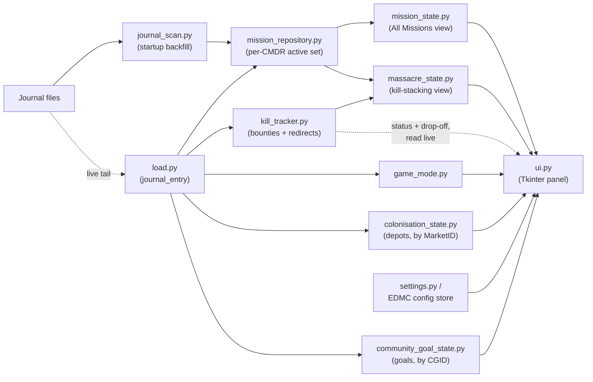

# EDMMM Technical Spec

A look under the hood: the stack, the plugin lifecycle, and how a journal
event turns into a row on the panel. Aimed at anyone reading the source or
contributing, not at end users — see [README.md](README.md) for that.

## Contents

- [Stack](#stack)
- [Plugin lifecycle (EDMC integration points)](#plugin-lifecycle-edmc-integration-points)
- [Data flow](#data-flow)
- [Per-commander isolation](#per-commander-isolation)
- [Mission classification](#mission-classification)
- [Kill-progress estimation](#kill-progress-estimation)
- [Config \& persistence](#config--persistence)
- [Build \& release](#build--release)
- [Auto-update](#auto-update)
- [Notable constraints](#notable-constraints)

## Stack

- **Language:** Python 3, standard library only — no third-party pip
  dependencies. `requirements.txt`/`pyproject.toml` don't exist because
  there's nothing to install beyond what EDMC and the stdlib provide.
- **UI:** Tkinter. The main panel (`ui.py`) is plain `tk` widgets so it
  inherits EDMC's theme colors automatically; the settings tab (`settings.py`)
  goes through EDMC's own `myNotebook` wrapper, since EDMC's prefs dialog may
  back it with `ttk` depending on EDMC's version. Since EDMC's panel is
  narrow, entries render as stacked 2–4 line "cards" (pack()-managed
  left/right line pairs, see `ui._line()`) rather than a wide grid table,
  and the whole panel is wrapped in a `Canvas`/`Scrollbar` capped at
  `ui._MAX_PANEL_HEIGHT` so a category with many missions scrolls instead
  of forcing the EDMC window past screen height.
- **Host application:** [EDMarketConnector](https://github.com/EDCD/EDMarketConnector)
  (EDMC). EDMC supplies the `config` module (settings persistence), the
  `theme` module (light/dark theme state), and the plugin lifecycle contract
  described below. EDMMM cannot run outside EDMC — it's a plugin, not an
  application.
- **Mission/kill/colonisation/CG data never leaves the machine.** All of
  that comes from local journal files (see [Data flow](#data-flow)) and
  nothing about it is ever sent anywhere. The one exception to "no network
  calls" at all is auto-update (`update.py`): a GitHub Releases API call
  plus a zip download, opt-out in Settings, sending nothing but the plain
  HTTP request itself (no telemetry, no journal data, no identifying
  payload) - see "Auto-update" below.
- **Build tooling:** `scripts/build.py` (stdlib `shutil`/`zipfile` only).
  CI/release run on GitHub Actions.

## Plugin lifecycle (EDMC integration points)

`EDMMM/load.py` is the plugin entry point — EDMC discovers and calls these
functions by name; it's not EDMMM that decides when they run:

- **`plugin_start3(plugin_dir) -> str`** — called once when EDMC starts.
  Kicks off the two-week journal backfill
  (`journal_scan.scan_journals`) and seeds `mission_repository`,
  `kill_tracker`, and `game_mode` with the result. Wrapped in a broad
  `try/except`: a scan failure logs and starts from empty state rather than
  blocking the plugin (and its settings tab) from loading at all. Also
  where `update.check_applied_update()` runs and `update.UpdateManager`'s
  background check is kicked off - see "Auto-update" below.
- **`plugin_app(parent) -> Frame`** — called once to get the widget EDMC
  embeds in its main window. Delegates straight to `ui.UI.set_frame`.
- **`journal_entry(cmdr, is_beta, system, station, entry, state)`** — called
  for *every* journal event, live, for the rest of the session. This is the
  plugin's main nervous system: it dispatches `Missions`, `MissionAccepted`,
  `MissionAbandoned`/`MissionCompleted`/`MissionFailed`, `MissionRedirected`,
  `Bounty`, `ColonisationConstructionDepot`, `ColonisationContribution`,
  `CommunityGoal`, and `LoadGame` to the relevant module. Everything else is
  ignored. The `system`/`station` parameters (EDMC's own current-docked
  values) are only consumed by the colonisation events - neither carries a
  location of its own, but both only ever fire while docked at the depot in
  question.
- **`plugin_prefs(parent, cmdr, is_beta)` / `prefs_changed(cmdr, is_beta)`**
  — build the Settings tab and commit changes when the dialog closes.

## Data flow

Two sources feed the *same* per-CMDR active-mission set, using an identical
event vocabulary:

1. **`journal_scan.scan_journals()`** — a one-time synchronous scan of the
   last two weeks of `*.log` files at startup. Filters to
   `Commander`/`MissionAccepted`/`Bounty`/`MissionRedirected`/`LoadGame`
   lines only (`_RELEVANT_EVENTS`) and returns a `ScanResult`.
2. **`load.journal_entry()`** — the same event types, live, one journal line
   at a time, for as long as EDMC keeps running.

Both converge on **`mission_repository.MissionRepository`**, the single
source of truth for "what's active right now, for whichever CMDR is
currently playing":

- It keeps two dicts per CMDR: `_mission_store` (every `MissionAccepted`
  ever seen for that CMDR, active or not — the full historical record) and
  `_active_by_cmdr` (the subset EDMC's own `Missions` login event confirms
  is still active).
- `active_missions` returns `None` until a `Missions` event has been seen
  for the current CMDR ("we don't know yet"). The UI uses that
  `None`-vs-empty-dict distinction to tell "no active mission data yet —
  relog" apart from "known, and genuinely zero missions."
- Every mutation re-emits through `active_missions_changed_event_listeners`
  — a plain list of callback functions appended to at import time, not a
  framework event bus. This same pattern (a module-level list of listeners)
  repeats in `mission_state`, `massacre_state`, `kill_tracker`, `game_mode`,
  and `settings`.

Two independent listeners subscribe to the repository and build their own
specialized view of it:

- **`mission_state.py`** builds a `Mission` for *every* active mission
  (any type), tagged with `mission_types.classify()`'s category and
  `mission_types.is_illegal()`. This backs the "All Missions" pages (3–7).
- **`massacre_state.py`** filters down to `mission_types.is_massacre_shaped()`
  missions only (a kill count against a target faction) and builds a
  `MassacreMission` per one. This backs the two detailed kill-stacking
  pages (1–2).

**`kill_tracker.py`** separately accumulates `Bounty` and `MissionRedirected`
evidence per CMDR, independent of which specific missions exist right now.
`massacre_state.compute_progress()` is what ties the two together — kill
progress isn't stored, it's recomputed from current mission + kill state
every time it's needed. `ui.py` does the same thing directly for Pages
3–7's per-mission Pending/Complete status and drop-off location — see
"Pending/Complete status and drop-off location" below — which is also why
`mission_state.py` subscribes to `kill_tracker.kill_data_changed_listeners`
purely to re-emit and trigger a redraw, the same way `massacre_state.py`
does.

**`game_mode.py`** is a third, independent per-CMDR store, fed only by
`LoadGame` events, for the header's mode label.

**`colonisation_state.py`** and **`community_goal_state.py`** are two more
independent per-CMDR stores, backing the Colonisation and Community Goals
pages. Neither is downstream of `mission_repository` at all - a
construction depot and a Community Goal are never accepted, never carry a
`MissionID`, and never go through `MissionAccepted`/`Missions` in any form.
Both follow the same "only re-emit on an actual CMDR switch" pattern as
`mission_repository.set_current_cmdr` (rather than kill_tracker's plain
per-cmdr dicts read directly by `ui.py`), so a freshly-switched-to CMDR
immediately sees whatever the journal backfill already found for them,
without waiting for a live event of their own:

- `colonisation_state.py` is keyed by `MarketID`, fed by
  `ColonisationConstructionDepot` (a full snapshot of the depot's build
  progress and per-commodity resource requirements each time it fires) and
  `ColonisationContribution` (this CMDR's own delivered total, accumulated
  separately from the depot-wide totals in the snapshot). Every depot ever
  docked at is kept for the CMDR's whole session - there's no "this depot
  is gone" event, only `ConstructionComplete`/`ConstructionFailed` flags on
  the latest snapshot.
- `community_goal_state.py` is keyed by `CGID`, fed by `CommunityGoal`'s
  `CurrentGoals` array. That array isn't scoped to "the CG at your current
  station" - a single event can list several CGs across different systems
  at once, and an already-expired CG keeps reappearing for a while after
  its own deadline (its evaluation/payout period, presumably) - confirmed
  from a live journal. There's no "this CG is gone" event either, so every
  CGID ever seen is kept indefinitely in the store; `ui.py` is what filters
  the page down to "not yet expired" using the same `Expiry` field missions
  use, reusing `_format_expiry`'s ISO parsing (`_is_expired` in `ui.py`).

**`ui.py`** subscribes to all of the above and is the only module that
touches Tkinter widgets directly. Every notification tears down and
rebuilds the *entire* panel (`update_ui` destroys all children of the
scrollable content frame, then redraws) rather than diffing — simplicity
over incremental-update performance, which is fine given the panel is
small and updates are infrequent (a mission accept/complete/expire, or the
60-second refresh tick — not per-frame). The optional "All missions" popup
(a `Toplevel`, opened from the category nav) follows the same
rebuild-on-notify pattern: `update_ui` refreshes it too, whenever it's
currently open.

**Gotcha for any future `Toplevel`:** it must be parented to
`self.__frame.winfo_toplevel()` (the actual EDMC root window), never to
`self.__frame`/`self.__content` themselves or anything inside them. A
`Toplevel` parented to a widget inside the panel becomes a child of that
widget in Tk's own widget tree, and EDMC's `theme.update()` recursively
walks a widget's children expecting only plain widgets — it raises
`TypeError: Expected widget, got <class 'tkinter.Toplevel'>` the moment it
encounters one, silently aborting the rest of `update_ui()` (this is
exactly what broke the "All missions" popup's live-refresh in
`v0.2.0-beta.1`: it was parented to `self.__frame`, so every mission
change while it was open crashed `theme.update(self.__frame)` before
`__refresh_popup()` ever ran). Positioning has the same "must anchor to
the real toplevel" requirement for a different reason: an unpositioned
`Toplevel` doesn't reliably land on the same monitor as EDMC on a
multi-monitor setup, so its geometry is explicitly computed from
`master.winfo_rootx()`/`winfo_rooty()` rather than left to the platform
default.

## Per-commander isolation

Every stateful module keys its store by CMDR name, not by session:
`mission_repository._mission_store`/`_active_by_cmdr`,
`kill_tracker._bounties`/`_redirected`,
`game_mode._mode_by_cmdr`/`_group_by_cmdr`. Switching commanders
(`mission_repository.set_current_cmdr`, itself driven by the `cmdr`
argument EDMC passes into every `journal_entry` call) just swaps which
CMDR's slice of each dict gets read, then re-emits — nothing is cleared or
rebuilt, so switching back to a previous commander is instant with no
re-scan. There is deliberately no cross-CMDR aggregation anywhere; this is
what the READMEs call "alt-friendly."

## Mission classification

`mission_types.classify()` is a pure function: given a `MissionAccepted`
event dict, return one of the 7 `CATEGORY_ORDER` keys. It's substring-hint
matching against the event's internal `Name` field (lower-cased), checked
in a fixed priority order — massacre-shaped first (`KillCount` +
`TargetFaction`, or name hints), then combat/trade/passenger/covert hints,
falling back to `OTHER`. There's no fuzzy matching or confidence score: a
mission either matches a hint substring or it doesn't. This is why
[CONTRIBUTING.md](CONTRIBUTING.md) asks for hint-string PRs when a mission
lands in the wrong category — it's almost always a missing hint, not a
logic bug.

`mission_types.is_mining_mission()` is a narrower, separate check used
only to gate the mining-method hint (see below) - it deliberately doesn't
fire for every Trade-category mission that happens to carry a `Commodity`
field, since Collect/Delivery missions carry one too (confirmed from a
live journal: `Mission_Collect_Industrial` commonly targets a genuinely
mineable commodity like Pyrophyllite or Cryolite, but those are bought and
delivered, not mined) - only `Mission_Mining*` internal names qualify.

## Mining method hint

`mining_methods.py` is a second static lookup, separate from
`mission_types.py`'s category hints: given a mining mission's target
commodity (`Commodity_Localised`, captured on `mission_state.Mission` only
when `mission_types.is_mining_mission()` is true), it returns which of the
game's three extraction methods - Core, Laser Surface, Sub-surface Deposit
- that commodity typically comes from. This can never be read from the
journal itself: a `MissionAccepted` event names the commodity but not the
ring or method needed to get it, because that's a property of wherever you
choose to mine it, not of the mission.

Most mineable commodities are Laser Surface only, so that's the table's
default; only a short, well-established list of "premium" minerals (Void
Opals, Painite, Alexandrite, ...) needs its own entry, because those
validly come from more than one method depending on the specific
ring/hotspot - the same "can't be resolved to one exact answer from
journal data alone" situation the Wing/ground kill-progress estimate
already lives with (see "Limitations for Wing/ground missions" above).
Rather than guess, `ui.py` shows every applicable method for a
multi-method commodity instead of picking one.

## Kill-progress estimation

`massacre_state.compute_progress()` is the one genuinely non-trivial
algorithm in the codebase, because of a fundamental gap in what the
journal reports: **a `Bounty` event never references a `MissionID`.** The
game just reports "you killed a member of faction X" — it doesn't say
which mission, if any, that kill should count against. Everything else in
the algorithm exists to close that gap by inference.

### How it works

1. **Kill evidence is collected independently of missions.**
   `kill_tracker.py` accumulates every `Bounty` and `MissionRedirected`
   event per CMDR as it arrives, with no knowledge of which missions are
   currently active. This decoupling matters at startup: the two-week
   journal backfill replays old events in file order, and a kill logged
   before its matching mission has even been reconstructed still needs
   somewhere to land.
2. **Mission-complete signals are authoritative and short-circuit
   everything.** `MissionRedirected` fires when the game itself decides a
   mission's kill objective is met. Any mission ID that's been redirected
   is marked done (`progress[id] = mission.count`) immediately and
   excluded from bounty matching entirely — no inference happens for it,
   because none is needed.
3. **Everything else is inferred from `Bounty` events, using the same
   rules the game itself uses for stacking:**
   - Open (non-redirected) missions are grouped by mission-giver faction
     (`source_faction`), then sorted oldest-accepted-first within each
     group.
   - For each bounty, in chronological order, the algorithm walks every
     giver's mission list and — for each giver independently — advances
     the *earliest still-open, not-yet-full* mission whose
     `target_faction` matches the bounty's `VictimFaction`, whose
     ground/space arena matches (`kill_tracker.is_ground_kill()` on the
     bounty vs. `mission.is_ground`), and which was accepted at or before
     the kill.
   - The inner loop `break`s after crediting one mission per giver, but
     the outer loop over givers does not stop — so a single kill can
     advance one mission from *each* distinct mission-giver
     simultaneously. This mirrors the actual in-game mechanic: if two
     factions both have a "kill Faction X" mission on your board, one kill
     nets a bounty voucher toward both, because each employer recognizes
     it independently. Crediting one mission *per giver* (rather than one
     total, or unlimited per giver) is what makes stacking of same-faction
     missions from different sources work correctly, while still
     preventing one kill from completing two missions from the *same*
     giver.

### Why redirected overrides the estimate

The bounty-matching rules above are a best-effort inference — matching
faction + arena + oldest-open-mission-per-giver is the closest available
approximation of "which mission did this kill belong to," but the journal
never confirms it directly. `MissionRedirected` is the one signal that
isn't inferred: it comes straight from the game's own bookkeeping.
Wherever the two disagree, redirected wins, unconditionally.

### Limitations for Wing/ground missions

The estimation side of this algorithm (step 3 above) is built exclusively
from **the current CMDR's own `Bounty` events.** That's a safe assumption
for a solo mission, since only the accepting commander's kills can
possibly count. It breaks down for Wing missions (the event's `Wing: true`
flag, tracked as `MassacreMission.is_wing`), because Frontier's
wing-mission design lets *any* wingmate's kill count toward *everyone's*
individual copy of that mission — and a wingmate's kill never produces a
`Bounty` event in your own journal. No journal field anywhere reports
"your wingmate killed one on your behalf."

Concretely:

- **Progress under-counts whenever wingmates are doing the killing.** If
  your wing is landing the kills and you're landing fewer of them, the
  panel's displayed count for a wing mission reflects only your personal
  kills, not the wing's combined total, and will sit low right up until
  the mission completes.
- **`is_wing` is never consulted by `compute_progress()`.** It's tracked
  on `MassacreMission` and used elsewhere purely for display (the
  shareable-reward total in `mission_state.py`, shown in brackets next to
  the reward on each faction's card in `ui.py`), but the progress algorithm
  applies identical
  faction/arena/giver matching whether or not a mission is a wing mission.
  There's no special-casing for shared credit — nor could there be, since
  no evidence of a wingmate's kill ever reaches the journal to special-case
  on.
- **This is why the `MissionRedirected` override matters most for wing
  missions.** Without it, a wing mission where wingmates land most of the
  kills would show as stuck at some partial count forever, since your own
  bounty stream would never reach `mission.count`. Because
  `MissionRedirected` is authoritative and independent of the bounty
  count, the mission still correctly flips to "done" the instant the game
  confirms it — but the displayed count can jump straight from a low
  partial number to fully complete in one step, skipping the intermediate
  values a solo mission would normally pass through one kill at a time.
- **There is no way to show a wing/solo split.** Because wingmate kills
  never appear in your journal at all, not even as an anonymized event,
  the plugin structurally cannot report something like "wing has done
  7/10, 2 of which were yours" — the underlying data doesn't exist locally
  to compute it.

This isn't a bug to fix so much as a hard ceiling imposed by what the
journal exposes: wing-mission progress should be read as "at least this
many, confirmed done the moment it flips."

**The same ceiling applies to solo on-foot (`is_ground`) missions, and it's
worse in practice.** Confirmed from a live journal on 2026-08-15: a solo,
non-wing `Mission_OnFoot_Massacre_MB` requiring 17 kills was verified
complete by the game (`MissionRedirected` then `MissionCompleted`), but
only **3** `Bounty` events with a matching `VictimFaction` appeared in the
entire session — the other ~14 kills produced no `Bounty` event, and no
other journal event (`FactionKillBond` or otherwise) filled the gap either.
A second concurrent solo ground mission requiring 10 kills had **zero**
matching `Bounty` events the whole time it was active. Unlike ship combat,
where a wanted kill reliably produces a `Bounty` voucher, most on-foot
kills at a settlement apparently don't generate one at all — the mission's
internal kill count is tracked server-side and isn't otherwise exposed
until the mission redirects. `ui.py` marks any faction row containing a
Wing or ground mission with a `~` prefix on the kills fraction (plus a page
warning) for exactly this reason: the number is a floor, not a fact, for
both cases.

## Pending/Complete status and drop-off location (Pages 3–7)

Unlike kill progress, this isn't stored or computed by `mission_state.py`
at all — `Mission` carries no status field. `ui.py` reads `kill_tracker`
directly at render time (`_mission_status()`/`_mission_location()` in
`ui.py`), the same pattern `massacre_state.compute_progress()` already uses:
a mission is "Complete" purely by virtue of its ID being in
`kill_tracker.get_redirected()`, reusing the exact signal massacre progress
treats as authoritative — see "Why redirected overrides the estimate"
above. Nothing new is inferred; this just surfaces a signal the plugin was
already collecting for every mission type, not only massacre ones.

The drop-off location follows the same live-read pattern:
`MissionRedirected` events are captured with their
`NewDestinationStation`/`NewDestinationSystem` fields (when present) in
`kill_tracker._redirect_destinations`, seeded from the journal backfill via
`journal_scan.ScanResult.redirect_destinations_by_cmdr`. Once a mission is
complete, `ui.py` shows that new location instead of the mission's original
destination; if the event carried no new destination (observed for at
least some mission types), it falls back to the original one.

Because nothing is baked into `Mission` at build time, live updates need
their own path: `mission_state.py` subscribes to
`kill_tracker.kill_data_changed_listeners` (`refresh()`) purely to re-emit
its already-built `_mission_store` unchanged, the same way
`massacre_state.refresh()` does — the re-emit is what triggers `ui.py` to
redraw, and the redraw is what re-reads `kill_tracker` for current status.

## Config & persistence

All persisted state (display toggles, current category page) goes through
EDMC's own config store (`config.get_bool`/`config.set`, imported from
EDMC's `config` module) — EDMMM has no database and no config files of its
own. The only disk I/O EDMMM owns outright is its rotating log file
(`logger_factory.py`). This is also why mission/kill tracking is entirely
in-memory and rebuilt from journals on every EDMC restart, while UI
preferences persist immediately and survive restarts on their own.

## Build & release

`scripts/build.py` is the only build step: stdlib-only, copies `EDMMM/`
into `dist/EDMMM/` (stripping `__pycache__`/`logs`) and zips it.
[`.github/workflows/ci.yml`](.github/workflows/ci.yml) runs that plus a
`py_compile` smoke test on every push/PR to `main`.
[`.github/workflows/release.yml`](.github/workflows/release.yml) runs the
same build and publishes a GitHub Release, but only on a `vX.Y.Z` tag push,
and only if the tag matches `EDMMM/version` exactly — so a release can
never publish a build whose in-app version label disagrees with its
download filename. See [CONTRIBUTING.md](CONTRIBUTING.md) for the full
release checklist.

## Auto-update

`update.py` is the plugin's one deliberate exception to "no network
calls": once per EDMC run, `UpdateManager.check_async()` spawns a daemon
thread (network I/O must never block EDMC's startup) that GETs
`RELEASES_API_URL` (`GET /repos/rwharpernc/EDMMM/releases/latest`), compares
its `tag_name` against `EDMMM/version`, and - if newer, not a draft, and
not a prerelease - downloads the release zip's asset into
`<plugin_dir>/updates/` and stages it directly over the running install.
Staging never reloads code; it only takes effect the next time EDMC
restarts and re-imports the plugin fresh. Uses stdlib `urllib`/`zipfile`
only, not the `requests` package EDMC itself bundles (unlike EDPPMT's
equivalent), to keep the "no third-party pip dependencies" property in
the Stack section above true even though the plugin isn't fully offline
anymore.

- **Enable/disable:** `edmmm.settings.configuration.auto_update` (a
  regular Settings-tab checkbox, on by default) is read once by
  `load.py.plugin_start3()` and passed into `check_async()` - `update.py`
  deliberately never imports `edmmm.settings` itself, to avoid a
  settings.py/update.py import cycle (settings.py needs `update.py`'s
  `RELEASES_PAGE_URL` for its version hyperlink). A `disable-auto-update.txt`
  sentinel file dropped in the plugin folder overrides the checkbox
  unconditionally - the dev handbrake for a copy you're actively
  hand-editing.
- **Staging, not replacing:** `_apply()` extracts the downloaded zip over
  `plugin_dir` file-by-file (stripping the zip's top-level `EDMMM/` folder,
  since `plugin_dir` already *is* that folder), so only files the new
  release actually ships get touched. `logs/`, `updates/`, `backups/`, and
  `__pycache__` are never part of a release zip (see `scripts/build.py`'s
  `EXCLUDE_DIR_NAMES`), so they're never touched by this either - the
  plugin's own log history and update bookkeeping survive every applied
  update untouched.
- **Backup before applying:** `_backup_current()` zips the entire current
  install (again excluding the same never-shipped folders) into
  `<plugin_dir>/backups/<timestamp>.zip` before `_apply()` runs, keeping
  the `BACKUPS_KEEP` (3) most recent; there's no restore UI yet, but the
  files are there for a manual rollback.
- **Applied-update detection:** `check_applied_update()` (called at the
  very top of every `plugin_start3()`) compares the running version
  against `EDMMM.last_version` recorded in EDMC's config store on the
  *previous* run. A mismatch means a staged update just took effect on
  this restart, which is the one-time "Updated to vX" confirmation
  `ui.py` shows on the main panel (auto-clears after 15s - see
  `_UPDATED_MESSAGE_DURATION_MS`).
- **Main-panel status line is otherwise silent.** Unlike EDPPMT (which
  always shows a version label), EDMMM's header only grows an extra line
  while there's actually something to say - downloading, staged-and-
  awaiting-restart, or just-applied - matching the rest of the panel's
  "only show a warning when there's something to warn about" style (the
  Settings tab's version label is always visible, and always links to
  `RELEASES_PAGE_URL`, whether or not an update is pending).
- **Thread-to-UI marshaling:** `UpdateManager`'s background thread never
  touches Tkinter directly - its `on_downloading`/`on_ready` callbacks
  (wired up in `load.py`) go through `ui.run_on_main_thread()`, which
  hands a plain callback to the frame's own `after(0, ...)`, the same
  pattern EDPPMT already uses successfully for this exact problem.

## Notable constraints

- **No automated tests beyond byte-compiling and a successful build.**
  EDMC's own modules (`config`, `theme`, `myNotebook`) aren't installable
  outside EDMC, so nothing in CI exercises the actual plugin logic — a
  live EDMC install is the only real verification path.
- **Single-threaded.** Everything runs on Tk's main loop via EDMC's own
  event dispatch; there's no background thread anywhere in the codebase.
  The startup journal scan runs synchronously and blocks the plugin's own
  startup until it finishes (mitigated by only scanning two weeks of
  files, not the full journal history).
- **Rebuild-everything-on-update.** `ui.py`'s content widget tree (and the
  "All missions" popup's, if it's open) is destroyed and recreated on
  every mission change and on every 60-second refresh tick
  (`REFRESH_INTERVAL_MS`). Fine at this scale; wouldn't scale to a much
  larger panel without a diffing layer. The `Canvas`/`Scrollbar` chrome
  around the content is the one part that persists across rebuilds rather
  than being recreated each time.
